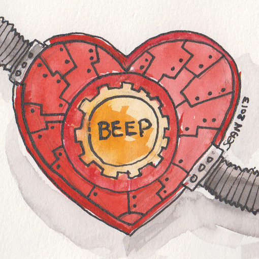

# Love Letters

## About ##

This is an anniversary gift to my partner, inspired by the work of Christopher Strachey. It is a JavaScript implementation of the love letters program that Strachey implemented using the Ferranti Mark I at the Manchester University Computing department in 1953-1954. As a geeky Mancunian in a same-gender relationship, I felt a connection to Strachey, a gay man writing love letters with computers in Manchester.

For more about Christopher Strachey, as well as other love letter implementations, see the following:
* [Christopher Strachey "Loveletters" (1952)](https://www.gingerbeardman.com/loveletter/)
* [2 Strachey Love Letters](https://gnoetrydaily.wordpress.com/2010/07/13/2-strachey-love-letters/)
* [LoveLetters_1.0, MUC=Resurrection. A Memorial. David Link](http://www.alpha60.de/art/love_letters/)
* [Christopher Strachey: The first digital artist?](http://web.archive.org./web/20140103193305/http://grandtextauto.org/2005/08/01/christopher-strachey-first-digital-artist/)
* [MOSI writes love letter to Ferranti](http://web.archive.org./web/20150322155545/http://www.mosi.org.uk/about-us/news/mosi-writes-love-letter-to-ferranti-(1).aspx)

The love letter JavaScript code implementation is located in _layouts/home.html

## Logo ##

Modified from <a href="https://www.flickr.com/photos/10678883@N00/8474116660">Robot heart goes BEEP!</a> by Sean McMenemy, published on <a href="https://www.flickr.com/">Flickr</a> under a <a href="https://creativecommons.org/licenses/by/2.0/">CC BY 2.0 license</a>

## Theme ##

This site uses the [no-style-please](https://github.com/riggraz/no-style-please) theme for Jekyll by [riggraz](https://github.com/riggraz).
